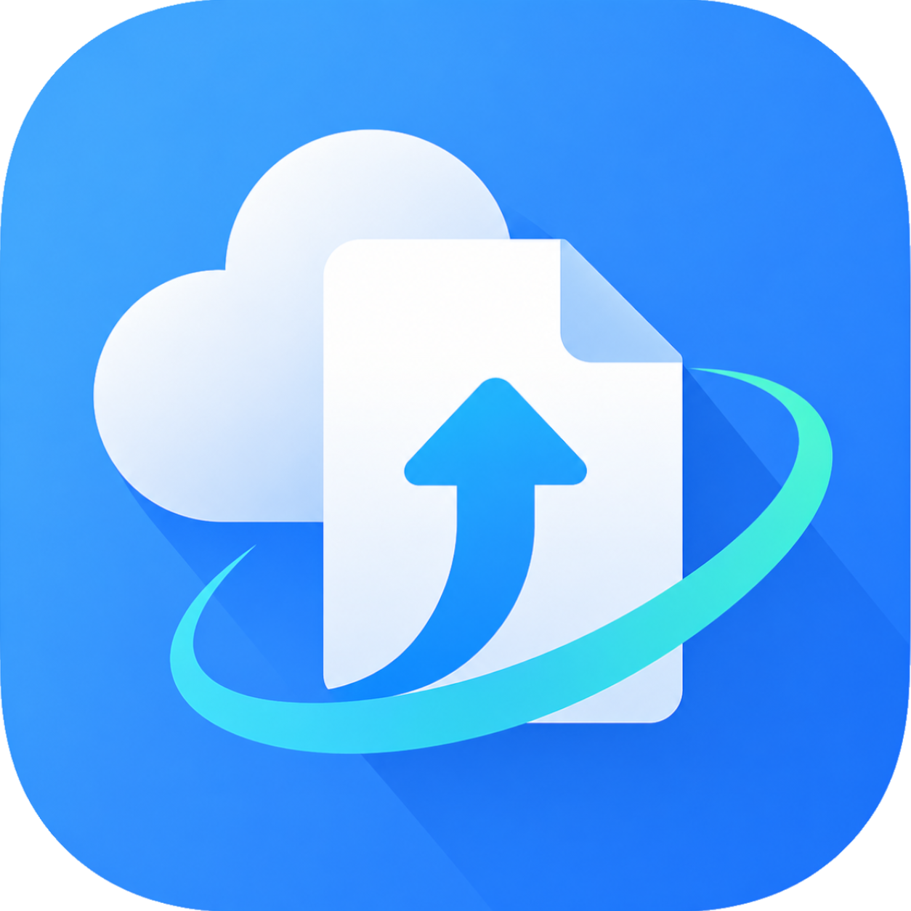

<p align="center">
  
</p>

<h1 align="center">QuickUp</h1>

Right-click any file in Windows Explorer, pick a host, and get a shareable URL
copied to your clipboard. No app to keep running, no dependencies beyond the
PowerShell that already ships with Windows.

<p align="center">
  
</p>

## Install

### Windows

```powershell
irm https://apps.riyo.me/install/quickup.ps1 | iex
```

Or download the repo and double-click **`install.cmd`** to pick install/uninstall.
The installer copies the script to `%LOCALAPPDATA%\QuickUp` and adds a per-user
context-menu entry (`HKCU`, no administrator rights needed).

### macOS / Linux

```sh
curl -fsSL https://apps.riyo.me/install/quickup.sh | sh
```

Needs `curl`. Integrates with the file managers it finds:

- **macOS** — Finder Quick Actions (`right-click → Quick Actions → QuickUp: <host>`)
- **Linux** — Nautilus (GNOME), Dolphin (KDE), Thunar (XFCE)

A dialog needs `zenity` or `kdialog` on Linux (`pbcopy`/`osascript` are built in on
macOS); clipboard uses `wl-copy`, `xclip`, or `xsel`.

## Use

Right-click a file → **QuickUp** → choose a host. The upload starts at once and
a small dialog shows the URL, already on your clipboard. **Copy** re-copies it,
**Open** launches it in your browser. **About** in the submenu lists what each
host accepts. A file a host can't take (too big, or a blocked type) is refused
before uploading, with a host that *does* accept it suggested.

## Hosts

| Host      | Retention                 | Max size | Blocked types                          |
| --------- | ------------------------- | -------- | -------------------------------------- |
| Catbox    | permanent                 | 200 MB   | `.exe .scr .cpl .doc .docx .jar`       |
| x0.at     | 3–100 days (smaller lasts longer) | 1 GB | executables (`.exe .dll .jar .class`)  |
| Litterbox | 1 hour                    | 1 GB     | `.exe .scr .cpl .doc .docx .jar`       |
| Uguu      | 3 hours                   | 128 MB   | executables, scripts, `.html .svg .jar .apk` |

Files are sent directly to the third-party host you pick; nothing is proxied.
Public hosts come and go — if one is unreachable or blocks your network, pick
another.

## Update

```powershell
# Windows
powershell -ExecutionPolicy Bypass -File "$env:LOCALAPPDATA\QuickUp\quickup.ps1" update
```

```sh
# macOS / Linux
sh quickup.sh update
```

Pulls the latest script and re-registers the menu.

## Uninstall

```powershell
# Windows
powershell -ExecutionPolicy Bypass -File "$env:LOCALAPPDATA\QuickUp\quickup.ps1" uninstall
```

```sh
# macOS / Linux
sh quickup.sh uninstall
```

## License

[MIT](LICENSE)
